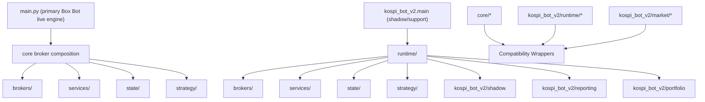
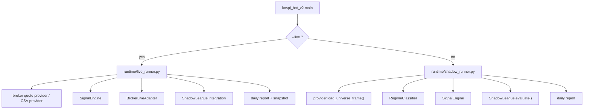

# KR Trading System Architecture Blueprint

Last updated: 2026-07-01

## Purpose

This document is the shortest complete blueprint for the current repo.

Use it when you need to answer:
- what exists
- which path is canonical
- which path is only compatibility
- where to modify broker/runtime/strategy/state behavior

## High-Level Shape

## Canonical Layer Map

### 1. `brokers/`

Broker-specific implementations only.

Primary files:
- [brokers/kis/api_client.py](/Users/hoisung/Downloads/kospi_trading_system/brokers/kis/api_client.py)
- [brokers/kis/client.py](/Users/hoisung/Downloads/kospi_trading_system/brokers/kis/client.py)
- [brokers/kis/quote_provider.py](/Users/hoisung/Downloads/kospi_trading_system/brokers/kis/quote_provider.py)
- [brokers/kiwoom/auth.py](/Users/hoisung/Downloads/kospi_trading_system/brokers/kiwoom/auth.py)
- [brokers/kiwoom/data_provider.py](/Users/hoisung/Downloads/kospi_trading_system/brokers/kiwoom/data_provider.py)
- [brokers/kiwoom/client.py](/Users/hoisung/Downloads/kospi_trading_system/brokers/kiwoom/client.py)

Responsibilities:
- auth/token
- quote/minute/tick/daily data
- balance and order execution
- broker-specific env keys and API quirks

### 2. `runtime/`

Execution entrypoints and orchestration.

Primary files:
- [runtime/live_runner.py](/Users/hoisung/Downloads/kospi_trading_system/runtime/live_runner.py)
- [runtime/shadow_runner.py](/Users/hoisung/Downloads/kospi_trading_system/runtime/shadow_runner.py)
- [runtime/market_hours.py](/Users/hoisung/Downloads/kospi_trading_system/runtime/market_hours.py)

Responsibilities:
- run loop orchestration
- live vs shadow mode separation
- market-hours gating
- post-close snapshot path

### 3. `services/`

Broker-neutral operational helpers.

Primary files:
- [services/account_balance.py](/Users/hoisung/Downloads/kospi_trading_system/services/account_balance.py)
- [services/market_data.py](/Users/hoisung/Downloads/kospi_trading_system/services/market_data.py)
- [services/order_execution.py](/Users/hoisung/Downloads/kospi_trading_system/services/order_execution.py)
- [services/sector_monitor.py](/Users/hoisung/Downloads/kospi_trading_system/services/sector_monitor.py)
- [services/null_sector_monitor.py](/Users/hoisung/Downloads/kospi_trading_system/services/null_sector_monitor.py)

Responsibilities:
- balance reporting
- broker-neutral market-data access wrapper
- generic order retry/token-refresh flow
- sector monitoring

### 4. `state/`

Persistent runtime/account state contracts.

Primary files:
- [state/account_snapshot.py](/Users/hoisung/Downloads/kospi_trading_system/state/account_snapshot.py)
- [state/position_manager.py](/Users/hoisung/Downloads/kospi_trading_system/state/position_manager.py)

Responsibilities:
- account snapshot contract
- local portfolio/position state ownership

### 5. `strategy/`

Strategy logic that should stay broker-neutral.

Primary files:
- [strategy/signal_analyzer.py](/Users/hoisung/Downloads/kospi_trading_system/strategy/signal_analyzer.py)
- [strategy/risk.py](/Users/hoisung/Downloads/kospi_trading_system/strategy/risk.py)
- [strategy/investor_flow.py](/Users/hoisung/Downloads/kospi_trading_system/strategy/investor_flow.py)

Responsibilities:
- signal scoring
- risk policy
- flow-based strategy logic

## Legacy and Compatibility Map

These paths still exist intentionally:

- `core/*`
  - compatibility wrappers for older imports
  - some legacy live-engine code still lives here
- `kospi_bot_v2/runtime/*`
  - compatibility wrappers to `runtime/*`
- `kospi_bot_v2/market/kis_quote_provider.py`
  - compatibility wrapper to `brokers/kis/quote_provider.py`
- `kospi_bot_v2/market/kiwoom_client.py`
  - compatibility wrapper to `brokers/kiwoom/auth.py`
- `kospi_bot_v2/market/kiwoom_data_provider.py`
  - compatibility wrapper to `brokers/kiwoom/data_provider.py`

Rule:
- new logic goes into canonical layers first
- compatibility paths should stay thin

## Entrypoint Map

### Legacy live path

- [main.py](/Users/hoisung/Downloads/kospi_trading_system/main.py)
  - current primary Box Bot live strategy authority
  - uses broker profile/factory and many `core/*` compatibility paths

### Modular runtime path

- [kospi_bot_v2/main.py](/Users/hoisung/Downloads/kospi_trading_system/kospi_bot_v2/main.py)
  - modular shadow/support entrypoint
  - live mode -> `runtime/live_runner.py`
  - shadow mode -> `runtime/shadow_runner.py`

## Strategy Identity Rule

There is only one primary strategy identity:
- `Box Bot`

Interpretation:
- `main.py` = primary live strategy authority
- `kospi_bot_v2` = shadow/support/modular runtime path

If useful logic exists in `kospi_bot_v2`, merge the logic into Box Bot.
Do not preserve a second competing live-strategy identity by accident.

## Runtime Flow

## Shadow League Ownership

Shadow-league logic is still owned by `kospi_bot_v2/shadow/*`.

Important files:
- [kospi_bot_v2/shadow/league.py](/Users/hoisung/Downloads/kospi_trading_system/kospi_bot_v2/shadow/league.py)
- [kospi_bot_v2/shadow/portfolio.py](/Users/hoisung/Downloads/kospi_trading_system/kospi_bot_v2/shadow/portfolio.py)
- [kospi_bot_v2/shadow/runner_integration.py](/Users/hoisung/Downloads/kospi_trading_system/kospi_bot_v2/shadow/runner_integration.py)
- [kospi_bot_v2/shadow/snapshot.py](/Users/hoisung/Downloads/kospi_trading_system/kospi_bot_v2/shadow/snapshot.py)

Current status:
- `ShadowRunner` is restored and working
- `LiveRunner` and `ShadowRunner` both compile
- `python -m kospi_bot_v2.main --sample` runs successfully

## Production Boundary

This repo is not the same as the active production server runtime.

Production runtime:
- server root: `/home/ubuntu/kospi_box_bot`
- service: `kospi_box_bot.service`

Do not assume local refactors deploy automatically to the server.

## Safe Change Rules

1. Add new broker-specific logic only under `brokers/`.
2. Add new orchestration only under `runtime/`.
3. Add new broker-neutral helpers under `services/`, `state/`, or `strategy/`.
4. Keep `core/*` wrappers import-safe while legacy code still uses them.
5. If changing real production behavior, update server runtime separately.

## Practical “Where Do I Edit?” Guide

- Broker auth/data/order issue:
  - `brokers/kis/*`
  - `brokers/kiwoom/*`
- Live/shadow execution issue:
  - `runtime/live_runner.py`
  - `runtime/shadow_runner.py`
- Signal/risk/flow logic:
  - `strategy/*`
- Position/account state:
  - `state/*`
- Backward-compatible legacy import issue:
  - `core/*` wrapper
